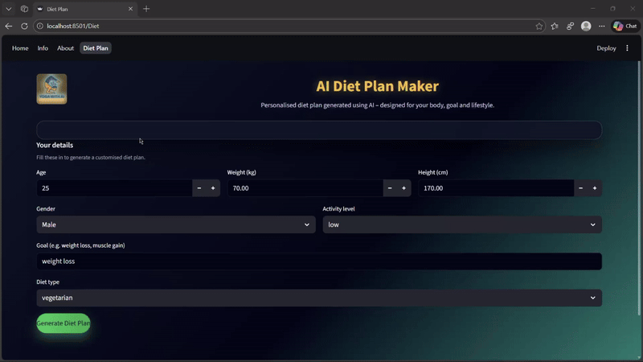

<p align="center">
  
</p>

<h1 align="center">🧘 Conscious Flow: AI Yoga</h1>

<p align="center">
  <b>AI-powered yoga practice. AI delivers personalized insights, pose recommendations, and real-time feedback—making yoga accessible and effective diet plan maker for vegans, non-vegetarians and vegetarians.</b>
</p>

<p align="center">
  
  
  
</p>

---

## 🚀 About  Conscious Flow

 Conscious Flow is an **AI-driven yoga practice and diet plan maker** built using **Streamlit**, designed to help yoga enthusiast practice yoga, receive AI-powered benefits and steps and built their own **Diet Plan**.

---

## ⭐ Key Features

## 🔹 For Enthusiasts
- 🎤 **AI-powered asanas**
- ✍️ Provides Asanas with their steps and benefits.
- 🤖 Real-time AI feedback for diet plan for vegans, vegetarian and non-vegetarian
- 📄 Also provides you the list of asanas to do to achieve the goal
- 👤 No User registration and login system required

---

## 🧰 Tech Stack

| Component | Technology |
|----------|------------|
| Frontend | Streamlit |
| Backend | Python |
| AI Model | Ollama |

---


---

## ⚙️ Installation

## **1️⃣ Clone the repo**
```bash
git clone https://github.com/nitintiwari5002/-Conscious-Flow-AI-Yoga.git
cd Conscious Flow
```

## **2️⃣ Install dependencies**
```bash
pip install -r requirements.txt
```

Or manually:
```bash
pip install streamlit
```
## **3️⃣ Install and run Ollama**

Download from → https://ollama.com

Pull a model (example):
```bash
ollama pull phi3:mini
```
## **4️⃣ Run the application**
```bash
streamlit run app.py
```


## **🌐 Environment Requirements**

- Python 3.9+

- Ollama installed and running locally at:
```bash
http://localhost:11434
```

- Stable internet connection (optional for updates)


## 🎥 Prototype Demo
[](https://github.com/nitintiwari5002/-Conscious-Flow-AI-Yoga/blob/main/a1-ezgif.com-video-to-gif-converter.gif)

---
[](https://github.com/nitintiwari5002/-Conscious-Flow-AI-Yoga/blob/main/a2-ezgif.com-video-to-gif-converter.gif)

---

<br></br>
<br></br>



## **🤝 Contributing**

Contributions are welcome!

- Fork this repo

- Create a new branch

- Make changes

- Open a pull request

## **📄 License**

This project is licensed under the MIT License.

### **❤️ Credits**

Built with passion for Yoga enthusiasts.
